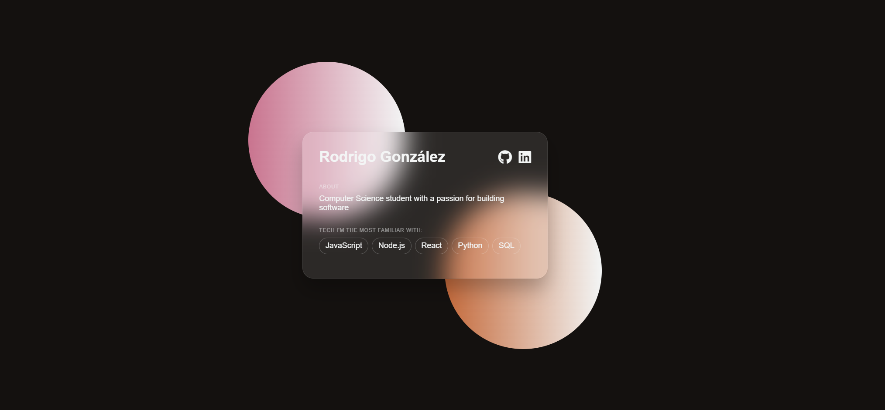

# Dev Profile Card

A minimalist yet aesthetic developer "profile card" featuring a glassmorphism design with gradient orbs. Built with vanilla HTML and CSS as a simple frontend syling exercise.

Cool enough to use as a digital version of a business card for developers!

[Check it out!](https://rodrigo-gonzalez-tech.github.io/dev-card/)

In an era where AI can one-shot full-stack apps, working on something this simple might seem pointless, but I want to make sure I have a solid foundation before I let the tools do the heavy lifting.

Also, it's a lot of fun!
